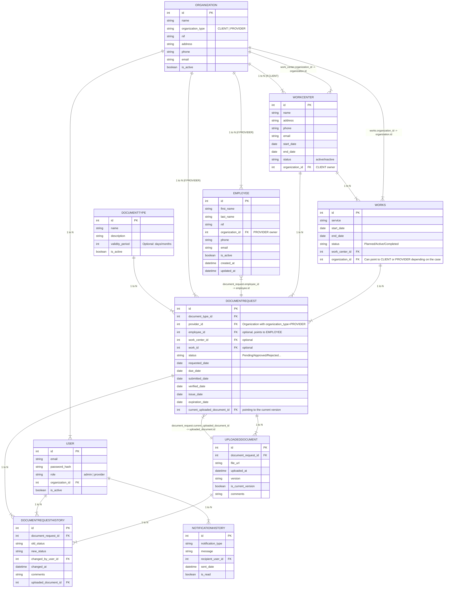

# Backend Specifications

## Table of Contents

1. [Backend Specifications](#backend-specifications)
    1. [Folder Structure](#folder-structure)
    2. [Data Model](#data-model)
        - [ERD Diagram](#erd-diagram)
        - [Table Relationships](#table-relationships)
    3. [Database Tables and Business Logic Documentation](#database-tables-and-business-logic-documentation)
        - [Organizations](#organizations)
        - [Users](#users)
        - [WorkCenters](#workcenters)
        - [Employees](#employees)
        - [Works](#works)
        - [DocumentTypes](#documenttypes)
        - [DocumentRequests](#documentrequests)
        - [UploadedDocuments](#uploadeddocuments)
        - [DocumentRequestHistory](#documentrequesthistory)
        - [NotificationHistory](#notificationhistory)
    4. [Backend Views & Endpoints Methodology](#backend-views--endpoints-methodology)
        - [Adopting Django’s Auth](#adopting-djangos-auth)
        - [View Types](#view-types)
        - [Suggested Endpoints (High-Level)](#suggested-endpoints-high-level)
            - [Accounts (User & Auth)](#accounts-user--auth)
            - [Organizations](#organizations-1)
            - [Works](#works-1)
            - [Documents](#documents)
            - [Notifications](#notifications)
    5. [Implementation Details](#implementation-details)


These specifications relate to both the models and views.

## Folder Structure

We will create an app for each main component of the application to follow best practices.

```
customer_document_management/
├─ manage.py
├─ customer_document_management/
│  ├─ __init__.py
│  ├─ asgi.py
│  ├─ wsgi.py
│  ├─ settings/
│  │  ├─ __init__.py
│  │  ├─ base.py
│  │  ├─ dev.py
│  │  ├─ prod.py
│  ├─ urls.py
│  └─ ...
├─ apps/
│  ├─ accounts/
│  │  ├─ __init__.py
│  │  ├─ admin.py
│  │  ├─ apps.py
│  │  ├─ models.py    (Direct usage of Django’s User, overriding the new field for role)
│  │  ├─ views.py
│  │  ├─ urls.py
│  │  └─ forms.py
│  ├─ organizations/
│  │  ├─ models.py    (Organization, WorkCenter)
│  │  ├─ views.py     (CRUD endpoints for Organization, WorkCenter)
│  │  ├─ urls.py
│  │  └─ ...
│  ├─ documents/
│  │  ├─ models.py    (DocumentType, DocumentRequest, UploadedDocument, etc.)
│  │  ├─ views.py     (Document CRUD, upload, validation)
│  │  ├─ urls.py
│  │  └─ ...
│  ├─ works/
│  │  ├─ models.py    (Works, linking Providers & WorkCenters)
│  │  ├─ views.py
│  │  ├─ urls.py
│  │  └─ ...
│  ├─ notifications/
│  │  ├─ models.py    (NotificationHistory)
│  │  ├─ views.py
│  │  ├─ urls.py
│  │  └─ ...
│  └─ core/           (common utilities, base classes, mixins, custom decorators, etc.)
│     ├─ ...
│
├─ requirements.txt
├─ README.md
└─ ...
```

Why this structure?

- Separation of Concerns: Each functional area (accounts, organizations, documents, etc.) lives in its own app.
- Reusability & Maintainability: Apps can be easily extended or reused, if needed, with minimal changes to unrelated areas.
- Scalability: As the system grows, we will be able to add more apps for specific functionality (e.g., “analytics”, “reports”, etc.) without cluttering existing ones.
- Settings Separation: Splitting settings into base.py, dev.py, and prod.py helps manage different environments cleanly.


## Data Model

### ERD Diagram


## Database Tables and Business Logic Documentation

This section details the core tables of the application and their corresponding business logic implementations.

---

### **ORGANIZATIONS**

- **Purpose:**  
  Represents both clients (property management firms) and service providers within the system.

- **Business Key:**  
  Differentiates organization types using the `organization_type` field:
  - **CLIENT:**  
    Property administrators managing communities.
  - **PROVIDER:**  
    Companies providing services and required to upload documentation.

---

### **USERS**

- **Purpose:**  
  Manages system access accounts and permissions.

- **Business Key:**  
  Defines three primary roles:
  - **admin:**  
    CUSTOMER staff with full access.
  - **provider:**  
    Users from provider companies who upload documentation.
  - **manager:**  
    Users managing communities.

---

### **WORKCENTERS**

- **Purpose:**  
  Represents each homeowners' community in the system.

- **Business Key:**  
  - Serves as the central point for community document management.
  - Links providers with the communities they serve.
  - Enables tracking of work and documentation per community.

---

### **EMPLOYEES**

- **Purpose:**  
  Records workers from provider companies.

- **Business Key:**  
  - Allows providers to manage their staff.
  - Facilitates linking specific documentation to individual workers.
  - Ensures regulatory compliance and monitoring.

---

### **WORKS**

- **Purpose:**  
  Records services or works performed in each community.

- **Business Key:**  
  - Links providers with specific communities.
  - Forms the basis for requesting documentation related to specific works.
  - Enables temporal tracking of services.

---

### **DOCUMENTTYPES**

- **Purpose:**  
  Catalogs the types of documents that can be requested.

- **Business Key:**  
  - Defines the documentation that can be required.
  - Allows setting standard validity periods.
  - Serves as the foundation for automating requests and renewals.

---

### **DOCUMENTREQUESTS**

- **Purpose:**  
  Manages documentation requests to providers.

- **Business Key:**  
  - Core component of the document management system.
  - Controls the lifecycle of each document request.
  - Links documents to specific works, employees, or workcenters.

---

### **UPLOADEDDOCUMENTS**

- **Purpose:**  
  Stores documents uploaded to the system.

- **Business Key:**  
  - Manages document versioning.
  - Maintains documentation history.
  - Enables validation and tracking of active documents.

---

### **DOCUMENTREQUESTHISTORY**

- **Purpose:**  
  Records changes in the status of documentation requests.

- **Business Key:**  
  - Provides complete traceability.
  - Enables change auditing.
  - Records the user who performed each validation or rejection.

---

### **NOTIFICATIONHISTORY**

- **Purpose:**  
  Manages system communications with users.

- **Business Key:**  
  - Automates reminders for pending documentation.
  - Notifies users of document validations or rejections.
  - Alerts about upcoming expirations.
  - Maintains a record of sent communications.

---

## Table Relationships

For detailed information about table relationships and the database schema, please refer to the [ERD Diagram](#) in the technical documentation.

---

## Backend Views & Endpoints Methodology

### **Adopting Django’s Authentication**

We will utilize Django’s built-in authentication system (`django.contrib.auth`) and extend it with additional fields as necessary for the project (e.g., the `role` field).

### **View Types**

- **Class-Based Views (CBV):**  
  Preferred for their reusability and organization, especially for standard CRUD operations.

- **Function-Based Views (FBV):**  
  Used when more granular control is required for specific endpoints.

- **Django REST Framework (DRF):**  
  Can be employed for building APIs if experience and project requirements permit.

### **Suggested Endpoints (High-Level)**

Below is an example set of URLs for each app. Prefix these with the app name or versioning (e.g., `/organizations/`, `/documents/`) to maintain a clean URL structure.

---

#### **Accounts (User & Auth)**

- **`accounts/login/`**  
  Login page.

- **`accounts/logout/`**  
  Logout endpoint.

  > **Note:**  
  There is no sign-in option as this is an internal app accessible only via invitation.

- **`accounts/profile/`**  
  Profile details, password changes, etc.

---

#### **Organizations**

- **`organizations/list/`**  
  List all organizations.

- **`organizations/create/`**  
  Create a new organization.

- **`organizations/<int:id>/edit/`**  
  Edit organization data.

- **`organizations/<int:id>/delete/`**  
  Delete or deactivate an organization.

---

#### **Workcenters**

- **`workcenters/list/`**  
  List all workcenters.

- **`workcenters/create/`**  
  Create a new workcenter.

- **`workcenters/<int:id>/edit/`**  
  Edit workcenter data.

- **`workcenters/<int:id>/delete/`**  
  Delete or deactivate a workcenter.

---

#### **Works**

- **`works/list/`**  
  List all works.

- **`works/create/`**  
  Create a new work record.

- **`works/<int:id>/edit/`**  
  Edit a work record.

- **`works/<int:id>/delete/`**  
  Delete a work record.

---

#### **Documents**

##### **DocumentTypes**

- **`documenttypes/list/`**  
  List all document types.

- **`documenttypes/create/`**  
  Create a new document type.

- **`documenttypes/<int:id>/edit/`**  
  Edit a document type.

- **`documenttypes/<int:id>/delete/`**  
  Delete a document type.

##### **DocumentRequests**

- **`documentrequests/list/`**  
  List all document requests with filtering options by status.

- **`documentrequests/<int:id>/detail/`**  
  Show details of a single request along with uploaded documents.

- **`documentrequests/create/`**  
  Admin creates a new document request.

- **`documentrequests/<int:id>/approve/`**  
  Admin approves a document request.

- **`documentrequests/<int:id>/reject/`**  
  Admin rejects a document request, triggering a notification.

##### **UploadedDocuments**

- **`documentrequests/<int:req_id>/upload/`**  
  Endpoint/page to upload a new document.

- **`uploadeddocuments/<int:id>/download/`**  
  Serve the file for download.

---

#### **Notifications**

- **`notifications/list/`**  
  List notifications for the logged-in user.

- **`notifications/<int:id>/mark_read/`**  
  Mark a notification as read.

---

### **Implementation Details**

- **View Implementation:**  
  For each route, create a corresponding class-based view in the respective `views.py` file. Examples include `OrganizationListView`, `OrganizationCreateView`, etc.

- **Permission Checks:**  
  Implement appropriate permission checks within views using:
  - Django’s `user_passes_test`
  - Mixins
  - DRF’s permission classes  
  Ensure users can only access data they are authorized to view.

- **User Interface:**  
  - **Initial Demo:** Use the Django Admin site.
  - **Post-Demo:** Develop a custom UI for both Admin and Provider sides using AdminLTE.

---

### **Final Notes**

These specifications serve as recommendations. If you have additional insights or suggestions, please feel free to discuss them with the team.

---

