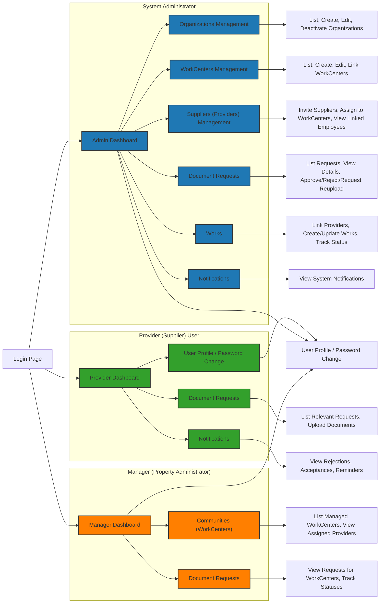

# Frontend Specifications

We will utilize Django's built-in frontend capabilities combined with the **AdminLTE** package for developing the application. This document provides a high-level overview that may be adjusted based on specific requirements and additional requests but serves as a foundational reference.

**Note:**  
- **UI Language:** Spanish  
- **Code Language:** English

---

## Main Pages

### For System Administrator (Admin Role)

1. **Login Page**
   - Utilizes the common Django login interface.
   - Includes logo, branding elements, etc.

2. **Admin Dashboard**
   - **Quick Stats:**
     - Number of requests pending review.
     - Number of providers.
     - Upcoming document expirations.
     - Other relevant metrics.

3. **Organizations Management**
   - **Features:**
     - List all organizations.
     - Create new organizations.
     - Edit existing organizations.
     - Deactivate organizations.
   - **Filters:**
     - Ability to filter based on specific fields (filters to be defined).

4. **WorkCenters Management**
   - **Features:**
     - List all WorkCenters.
     - Create new WorkCenters.
     - Edit existing WorkCenters.
     - Link WorkCenters to the appropriate CLIENT.
   - **Filters:**
     - Ability to filter based on specific fields (filters to be defined).

5. **Suppliers (Providers) Management**
   - **Features:**
     - Invite new suppliers (create a PROVIDER organization + user).
     - Assign existing suppliers to a WorkCenter (if they operate there).
     - View linked employees in detail view.
   - **Filters:**
     - Ability to filter based on specific fields (filters to be defined).

6. **Document Requests**
   - **Features:**
     - List all requests with filtering options by status (pending, under review, approved, rejected).
     - Detail view to see uploaded documents.
     - Approve, reject, or request reupload of documents.

7. **Works**
   - **Features:**
     - Link providers to specific works for a given WorkCenter.
     - Create or update work records.
     - Track status of works (Planned, Active, Completed).

8. **Notifications**
   - **Features:**
     - View system notifications (e.g., warnings, upcoming document expirations).

---

### For Provider (Supplier) User

1. **Login**
   - Access restricted to data relevant to their organization.

2. **Provider Dashboard**
   - **Features:**
     - Show pending document requests.
     - Summary of completed/approved documents.
     - Quick reminders of upcoming expirations.

3. **Document Requests**
   - **Features:**
     - List of requests relevant to the provider or their assigned employees.
     - Detail page with an “Upload Document” form.

4. **Notifications**
   - **Features:**
     - Receive notifications for rejections, acceptances, and reminders.

---

### For Manager (Property Administrator) *(Optional)*

**Note:**  
The necessity of a separate Manager role is under consideration. Currently, the Admin role may handle Manager tasks.

If implemented, the Manager role includes:

1. **Login**

2. **Manager Dashboard**
   - **Features:**
     - Summarize communities (WorkCenters).
     - Display ongoing works.
     - Show pending documents from providers.

3. **Communities (WorkCenters)**
   - **Features:**
     - List of WorkCenters managed.
     - View assigned providers.

4. **Document Requests**
   - **Features:**
     - View requests for their WorkCenters.
     - Track statuses of document requests.

---

### Common Screens/Views

- **User Profile / Password Change**
  - Allows users to update their name, phone number, or password.

---

## Navigation Diagram

Below is a simplified diagram illustrating how different roles navigate through the application:

---

## Implementation Notes

- **Initial Development:**
  - Use Django's Admin site for the first demo.
  
- **Post-Demo Development:**
  - Create a custom UI for both Admin and Provider sides using AdminLTE.

- **Customization:**
  - Specifications are recommendations. Feel free to propose enhancements or modifications as needed.

---

## Final Notes

These frontend specifications provide a foundational structure for developing the application's user interface. Adjustments and refinements may be necessary as the project progresses to accommodate specific requirements and feedback.

---
